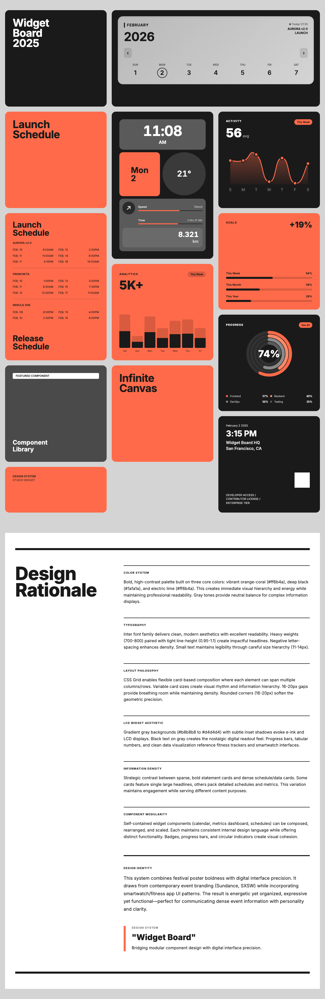
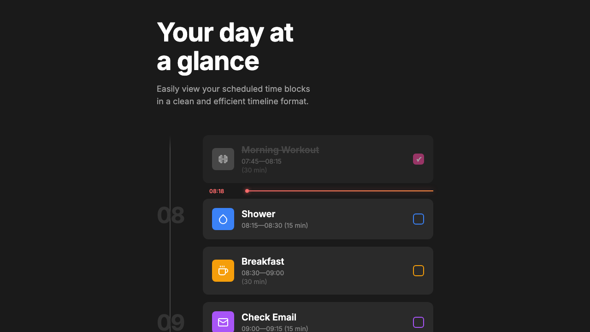
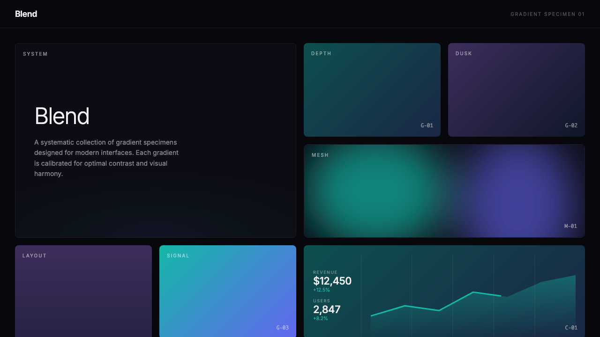
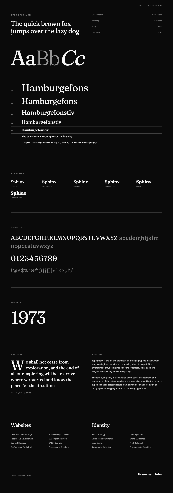

# Design Experiments

A sandbox for exploring visual design systems, widgets, and layouts.

---

## Experiments

### Stratum

**February 2, 2026**

[](https://smc-sandbox.netlify.app/2026-01-28-color-spec/)

Interactive brand guidelines with React-powered color customization. Click the gear icon to open a push-in sidebar with live color editing - changes apply instantly across the entire page. Features composable Card components with context-based inheritance, semantic color naming, Chroma.js scale generation, and real-time CSS variable updates that persist via localStorage.

**Tags:** React Components • Interactive • Color Systems • Single-File App

**[View Code ->](./2026-01-28-color-spec/)**

---

### Design Festival

**February 2, 2026**

[](https://smc-sandbox.netlify.app/2026-01-28-design-festival/)

Card-based layout system combining festival poster boldness with digital interface precision. Features animated React widgets including an Activity chart with SVG line-drawing animation, Goals progress bars, Analytics bar charts, concentric progress rings, and an interactive calendar. All widgets support click-to-regenerate with randomized data.

**Tags:** React • Animated Widgets • CSS Grid • Festival Aesthetic

**[View Code →](./2026-01-28-design-festival/)**

---

### Day at a Glance

**February 2, 2026**

[](https://smc-sandbox.netlify.app/2026-01-28-day-at-a-glance/)

Clean 3-column CSS grid timeline with colored sidebar bars, SVG icons, and a subtle "now" indicator line that shows through semi-transparent event cards. Features split color bars for past/upcoming visualization and continuous horizontal hour lines.

**Tags:** CSS Grid • Timeline • Z-Index Layering • Dark Theme

**[View Code →](./2026-01-28-day-at-a-glance/)**

---

### Blend

**February 2, 2026**

[](https://smc-sandbox.netlify.app/2026-01-28-blend/)

Swiss modernist gradient specimen system featuring organic mesh gradients via SVG blur technique. Includes 27 gradient cards across linear and mesh styles, systematic labeling (G-01 through G-09, M-01 through M-18), scroll-triggered animations, and an analytics dashboard mockup.

**Tags:** Gradients • SVG Mesh • Swiss Design • Scroll Animation

**[View Code →](./2026-01-28-blend/)**

---

### Spec Sheet

**January 28, 2026**

[](https://smc-sandbox.netlify.app/2026-01-28-spec-sheet/)

Bold typographic layout with dark/light mode toggle. Features strong hierarchy through scale contrast, clean sectioning, and a professional two-color aesthetic.

**Tags:** Typography • Dark Mode • Minimal • Two Column

**[View Code →](./2026-01-28-spec-sheet/)**

---

## Development

```bash
npm run dev      # Start dev server on port 3000
npm run build    # Build for production
npm run preview  # Preview production build
```

## Structure

```
/
├── index.html                    # Homepage with visual gallery
├── screenshots/                  # Preview images for homepage/README
├── YYYY-MM-DD-experiment-name/   # Dated experiment folders
│   ├── index.html                # The experiment
│   ├── README.md                 # Documentation
│   └── screenshots/              # Design iterations
└── CLAUDE.md                     # Workflow guidance
```

## Purpose

This sandbox is for rapid design exploration—building visual systems, testing layouts, and creating reusable design patterns. Each experiment is self-contained and can be copied out independently.

---

**View live experiments:** https://smc-sandbox.netlify.app/
