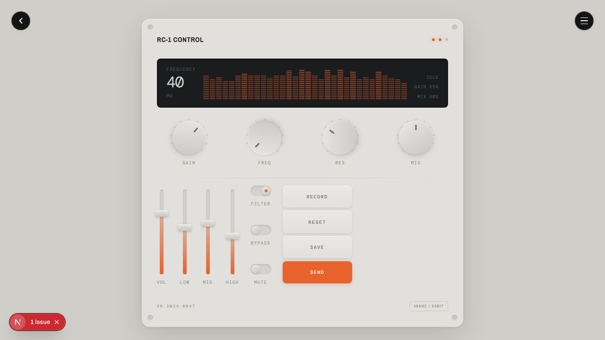
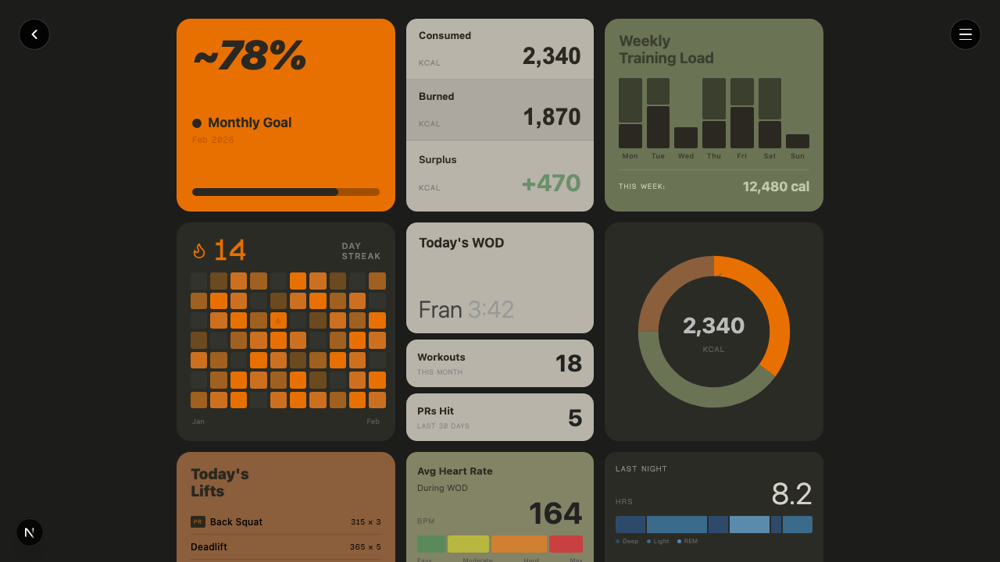
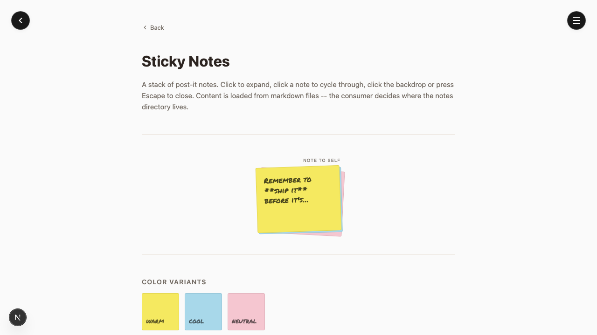
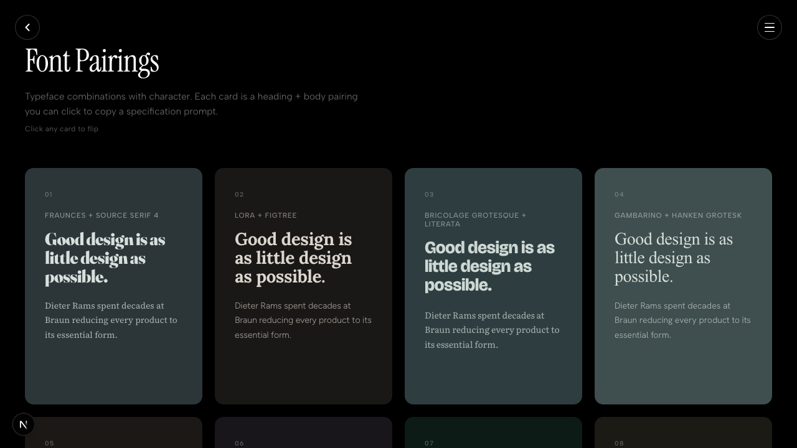
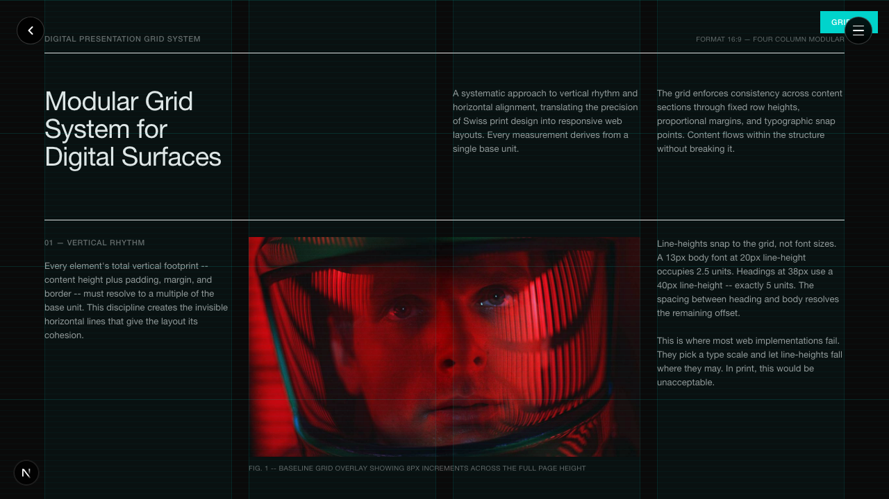
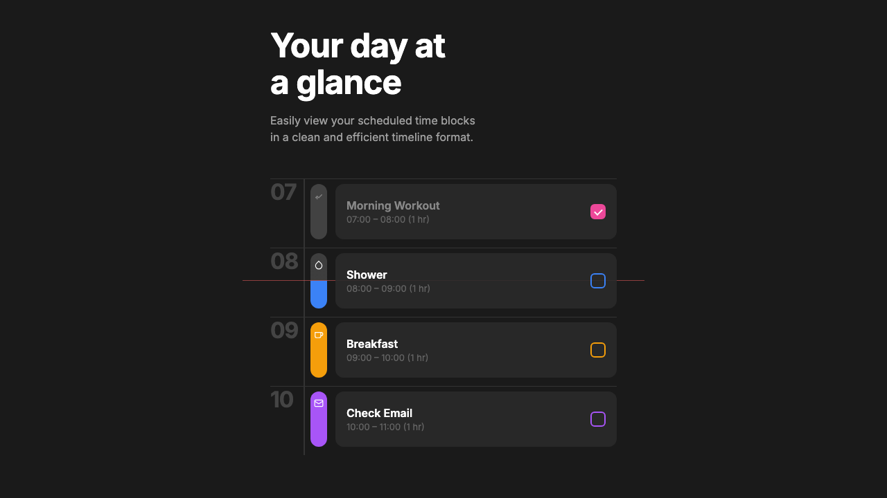
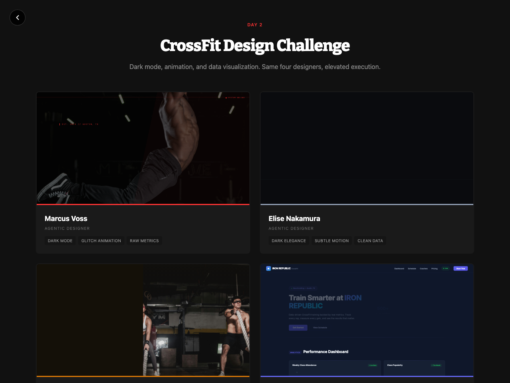
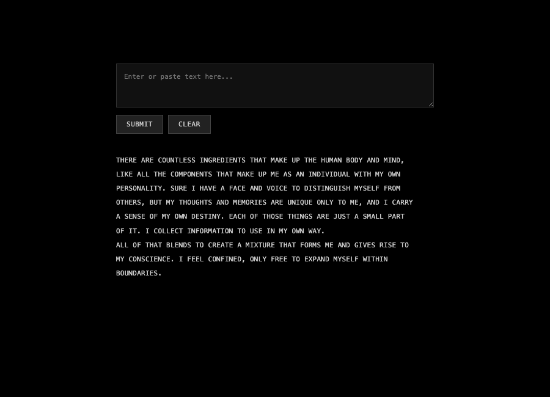
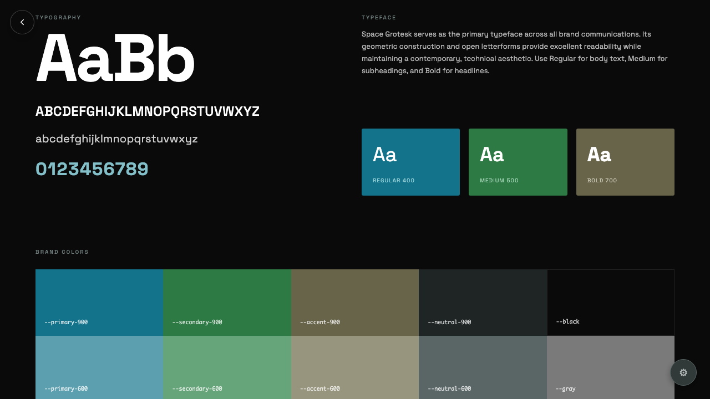
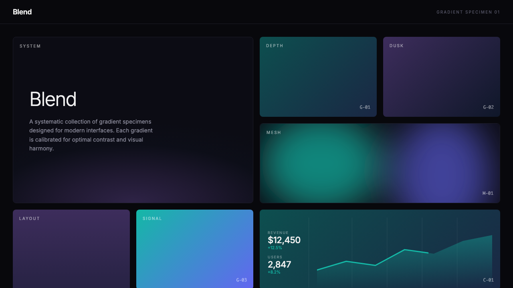

# Design Experiments

A Next.js-based sandbox for exploring visual design systems, widgets, and interactive patterns.

> **Heads up:** This is a personal sandbox -- me coding in public. Experiments get added, removed, and rewritten all the time. Feel free to browse, but don't depend on anything here staying put.

This is a design sketchbook, not production software. There's no test suite and that's intentional -- the point is rapid experimentation and learning in public, not shipping stable APIs. Things break, get rewritten, and disappear without notice.

---

## Experiments

### Retro Tech Control Panel

**February 20, 2026**

[](https://www.joshcoolman.com/design-experiments/retro-tech)

Hardware-inspired control panel rendered in CSS. Aluminum chassis with corner screws, OLED-style display with animated segmented LED meters, rotary knobs with drag interaction, vertical faders, toggle switches, tactile buttons, and a self-filling perf-grid speaker grille. Inspired by Teenage Engineering TP-7/TX-6, Braun noise gate pedal, and Work Louder numpad. DM Mono labels with Archivo Narrow model name. Warm gray surface palette with single orange accent.

**Tags:** Hardware UI - Neumorphic - Interactive Controls - CSS Animation

**[View Live →](https://www.joshcoolman.com/design-experiments/retro-tech) | [View Code →](https://github.com/joshcoolman-smc/sandbox/tree/main/app/design-experiments/retro-tech)**

---

### CrossFit Bento

**February 20, 2026**

[](https://www.joshcoolman.com/design-experiments/crossfit-bento)

Dark bento grid dashboard for CrossFit training data. Nine widget cards covering goal progress, calorie tracking, weekly training load bar chart, GitHub-style activity heatmap with flame icons on peak days, WOD stats, macro donut chart, exercise log with PR badges, heart rate zones, and sleep stages. DM Sans body with Geist Pixel Square for technical labels. Matte finish palette -- orange, olive, brown accents on near-black.

**Tags:** Bento Grid - Dashboard - Geist Pixel - Dark Theme

**[View Live →](https://www.joshcoolman.com/design-experiments/crossfit-bento) | [View Code →](https://github.com/joshcoolman-smc/sandbox/tree/main/app/design-experiments/crossfit-bento)**

---

### Sticky Notes

**February 18, 2026**

[](https://www.joshcoolman.com/design-experiments/sticky-notes)

Interactive sticky note stack component. Post-it notes rendered from markdown files with swipe-to-cycle animation, color variants (warm, cool, neutral), and Permanent Marker handwriting font. Click to expand, click to cycle, Escape to close. Portable design -- consumer passes a notes directory path, so any page can use it with its own content. Currently used by the blog for "note to self" thoughts.

**Tags:** Component - CSS Animation - Markdown Content - Portable

**[View Live →](https://www.joshcoolman.com/design-experiments/sticky-notes) | [View Code →](https://github.com/joshcoolman-smc/sandbox/tree/main/app/design-experiments/sticky-notes)**

---

### Contact Sheet

**February 17, 2026**

[](https://www.joshcoolman.com/design-experiments/contact-sheet)

Image folder browser for building file lists to share with LLMs. Pick a folder, click images to select them, and a sidebar shows your selections with thumbnails. Copy the filename list to clipboard with one click. Designed for the workflow of visually identifying images then telling an LLM which ones to work with. Everything runs client-side -- nothing gets uploaded.

**Tags:** Utility - File API - Client-Side - Dark Theme

**[View Live →](https://www.joshcoolman.com/design-experiments/contact-sheet) | [View Code →](https://github.com/joshcoolman-smc/sandbox/tree/main/app/design-experiments/contact-sheet)**

---

### Font Pairings

**February 15, 2026**

[](https://www.joshcoolman.com/design-experiments/font-pairings)

A collection of 40 curated Google Font pairings, each displayed on its own color-palette card. Click any card to copy an LLM-ready specification prompt. Includes superfamily pairings, monospace+sans combos, and brand design system fonts. Avoids overused defaults -- no Montserrat, Roboto, Open Sans, Lato, Playfair Display, Raleway, Poppins, or Inter. Static HTML with inline CSS, no framework.

**Tags:** Typography - Font Pairings - Static HTML - Copy-to-Clipboard

**[View Live →](https://www.joshcoolman.com/design-experiments/font-pairings) | [View Code →](https://github.com/joshcoolman-smc/sandbox/tree/main/app/design-experiments/font-pairings)**

---

### Modular Grid

**February 14, 2026**

[](https://www.joshcoolman.com/design-experiments/modular-grid)

Swiss-inspired modular grid system for digital surfaces. 8px base unit, 4-column layout with proportional margins and gutters, strict vertical rhythm. Includes toggleable cyan grid overlay, type specimen, image treatment demos, and system spec table. Dark mode adaptation of a print-precision layout methodology originally built in Claude Desktop.

**Tags:** Grid System - Swiss Design - Dark Mode - Typography

**[View Live →](https://www.joshcoolman.com/design-experiments/modular-grid) | [View Code →](https://github.com/joshcoolman-smc/sandbox/tree/main/app/design-experiments/modular-grid)**

---

### Day at a Glance

**February 12, 2026**

[](https://www.joshcoolman.com/design-experiments/day-at-a-glance)

Time-aware workday timeline with a dynamic now-line that tracks real time. Features a 9am-5pm schedule with colored event bars that partially fill as the hour progresses -- gray above the now-line, color below. Past events auto-dim. Built with CSS grid, inline linear-gradient for the fill effect, and 60-second interval updates.

**Tags:** CSS Grid - Timeline - Dynamic State - Dark Theme

**[View Live →](https://www.joshcoolman.com/design-experiments/day-at-a-glance) | [View Code →](https://github.com/joshcoolman-smc/sandbox/tree/main/app/design-experiments/day-at-a-glance)**

---

### CrossFit Design Challenge

**February 9, 2026**

[](https://www.joshcoolman.com/design-experiments/crossfit-challenge)

Four AI personas -- brutal/industrial, minimal/refined, editorial/magazine, and tech/data-forward -- each designed a CrossFit homepage for IRON REPUBLIC gym. Dark mode across all designs, meaningful animation (glitch effects, scroll reveals, chart animations), and data visualization (SVG charts, radial indicators, bar graphs). Pure CSS animations, no external libraries.

**Tags:** Dark Mode - CSS Animation - Data Viz - Agent Teams

**[View Live →](https://www.joshcoolman.com/design-experiments/crossfit-challenge) | [View Code →](https://github.com/joshcoolman-smc/sandbox/tree/main/app/design-experiments/crossfit-challenge)**

---

### Terminator - Text Scramble

**February 6, 2026**

[](https://www.joshcoolman.com/design-experiments/terminator)

Interactive terminal-style text scramble effect with two-phase animation. Enter custom text to see it scramble chaotically for 1 second, then resolve sequentially line-by-line. Features balanced line breaking and automatic uppercase conversion. Default text: Ghost in the Shell quote on identity and consciousness.

**Tags:** Text Animation - Terminal UI - Interactive - Split-Flap Effect

**[View Live →](https://www.joshcoolman.com/design-experiments/terminator) | [View Code →](https://github.com/joshcoolman-smc/sandbox/tree/main/app/design-experiments/terminator)**

---

### Color Spec

**February 6, 2026**

[](https://www.joshcoolman.com/design-experiments/color-spec)

Interactive brand guidelines with live color and typography customization. Features animated Activity line chart and Analytics bar chart widgets with CSS-only animations. Click the gear icon for a push-in sidebar with color pickers using Chroma.js scale generation and 9 curated font pairings. All changes persist via localStorage.

**Tags:** React Components - Animated Charts - Color Systems - Typography

**[View Live →](https://www.joshcoolman.com/design-experiments/color-spec) | [View Code →](https://github.com/joshcoolman-smc/sandbox/tree/main/app/design-experiments/color-spec)**

---

### Blend

**February 2, 2026**

[](https://www.joshcoolman.com/design-experiments/blend)

Swiss modernist gradient specimen system featuring organic mesh gradients via SVG blur technique. Includes 27 gradient cards across linear and mesh styles, systematic labeling (G-01 through G-09, M-01 through M-18), scroll-triggered animations, and an analytics dashboard mockup.

**Tags:** Gradients - SVG Mesh - Swiss Design - Scroll Animation

**[View Live →](https://www.joshcoolman.com/design-experiments/blend) | [View Code →](https://github.com/joshcoolman-smc/sandbox/tree/main/app/design-experiments/blend)**

---

## Development

```bash
npm run dev    # Start Next.js dev server on port 3000
npm run build  # Build for production
npm start      # Run production build
```

## Blog

The site includes a markdown-powered blog at [joshcoolman.com/blog](https://www.joshcoolman.com/blog) with posts on design, AI agents, and working with code. Posts live in `blog/` as `.md` files with frontmatter.

**[View Blog →](https://www.joshcoolman.com/blog)**

---

## Recommended

A curated collection of links -- YouTube videos, GitHub repos, and web tools -- with personal commentary and auto-fetched thumbnails. New links are added via the `/recommend` skill. Each item is a markdown file with frontmatter (url, date, optional title) and a one-line comment.

Thumbnails resolve automatically at build time: YouTube via oEmbed, GitHub via OG images, and web links via manual screenshots taken with agent-browser.

**[View Recommended →](https://www.joshcoolman.com/recommended)**

---

## Docs

Internal documentation and reference material rendered at [joshcoolman.com/docs](https://www.joshcoolman.com/docs). Markdown files in `docs/` with sidebar navigation, syntax highlighting, and table of contents.

**[View Docs →](https://www.joshcoolman.com/docs)**

---

## Structure

```
/
├── app/                          # Next.js App Router
│   ├── page.tsx                  # Homepage
│   ├── layout.tsx                # Root layout with SEO metadata
│   ├── sitemap.ts                # Dynamic sitemap
│   ├── robots.ts                 # Crawler rules
│   ├── design-experiments/
│   │   ├── page.tsx              # Experiments gallery
│   │   └── [experiment]/         # Each experiment is a self-contained route
│   ├── (blog)/blog/              # Blog index and post pages
│   ├── (blog)/recommended/       # Recommended links page
│   ├── (blog)/notes/             # Sticky note markdown files
│   └── (docs)/docs/              # Docs viewer with sidebar nav
├── lib/
│   ├── experiments/data.ts       # Shared experiments metadata
│   ├── blog/                     # Blog loader and types
│   └── docs/                     # Docs loader and utilities
├── blog/                         # Markdown blog posts
├── docs/                         # Markdown documentation
├── public/
│   └── screenshots/              # Preview images for README
└── CLAUDE.md                     # Development workflow
```

## Adding New Experiments

1. Create `app/design-experiments/[name]/page.tsx` with your React component
2. Add screenshot to `public/screenshots/[name].png`
3. Add experiment to `lib/experiments/data.ts`
4. Update this README with experiment details

---

## Claude Code Skills

This repo includes custom skills for [Claude Code](https://claude.ai/code) that streamline common development workflows. While not all skills are specific to this sandbox project, they're general-purpose utilities I use across different projects.

### Available Skills

**Design Experiment Pipeline:**

**`/sketch`**
Rapid visual prototyping -- paint with code. Two files (page.tsx + styles.css), plain CSS with descriptive class names, no component libraries, no data layer. The napkin drawing before the architecture.

**`/design-experiment`**
Create a new design experiment in the sandbox. Scaffolds the route, page, and styles following project conventions.

**`/design-audit`**
Audit a design experiment's CSS for color and type consistency. Extracts every color and font-size, flags near-duplicates, suggests unifications. Interactive -- select which fixes to apply.

**`/animation-audit`**
Audit a design experiment for entrance animations, stagger timing, and interaction feedback. Proposes spring presets for consistency and wires up click-to-replay.

**`/ts-handoff`**
Light TypeScript cleanup to make components handoff-ready. Catches real bugs and hygiene issues without over-engineering. The final pass before shipping.

**`/promote`**
Make a design experiment importable. Runs the full quality pipeline, extracts components, designs a public API, and creates a barrel export.

**`/ship-experiment`**
Ship a design experiment: screenshots with agent-browser, updates gallery and README, commits and pushes to GitHub.

**Content:**

**`/recommend`**
Add a link to the Recommended page. Pass a URL and a comment -- the skill detects the source type (YouTube, GitHub, web), creates a markdown file, handles screenshots for web links, and runs a production build to trigger thumbnail downloads.

**`/blog-post`**
Draft a blog post from conversation context. Creates markdown with a placeholder image, immediately visible on the homepage and blog index.

**`/note`**
Quick-fire a sticky note from the command line. Everything after `/note` becomes a new markdown file with auto-derived filename and rotating color.

**Utilities:**

**`/sanity-check`**
Quick React/TypeScript/Next.js code review from a senior engineer perspective. Catches common issues and suggests practical improvements.

**`/supabase`**
Supabase CLI wrapper for database operations: schema migrations, TypeScript type generation, edge function deployment, and postgres best practices.

**`/bitmap-to-vector`**
Convert raster images (PNG, JPG, etc.) to clean, icon-ready SVG vectors using potrace. Auto-detects threshold and polarity, strips bounding rectangles, outputs `fill="currentColor"` SVGs ready for inline use or CSS masks.

### Using Skills

Skills are invoked with a slash command in Claude Code:

```bash
/sketch A breathing app with animated circles  # Rapid visual prototype
/design-experiment Interactive color palette    # Scaffold new experiment
/design-audit crossfit-bento                    # Audit colors and type
/animation-audit crossfit-bento                 # Add entrance animations
/ts-handoff crossfit-bento                      # TypeScript cleanup
/promote sticky-notes                           # Extract reusable component
/ship-experiment                                # Ship the current experiment
/recommend https://example.com Great tool        # Add recommended link
/blog-post "Design as Dialogue"                 # Draft a blog post
/note Remember to update the docs               # Quick sticky note
/sanity-check                                   # Review current code
/supabase migrate "add users table"             # Database migration
/bitmap-to-vector logo.png                      # Vectorize an image
```

### Skill Location

Skills are stored in `.claude/skills/` and are committed to this repo. They work in any project when this directory structure is present, or can be copied to other repos individually.
