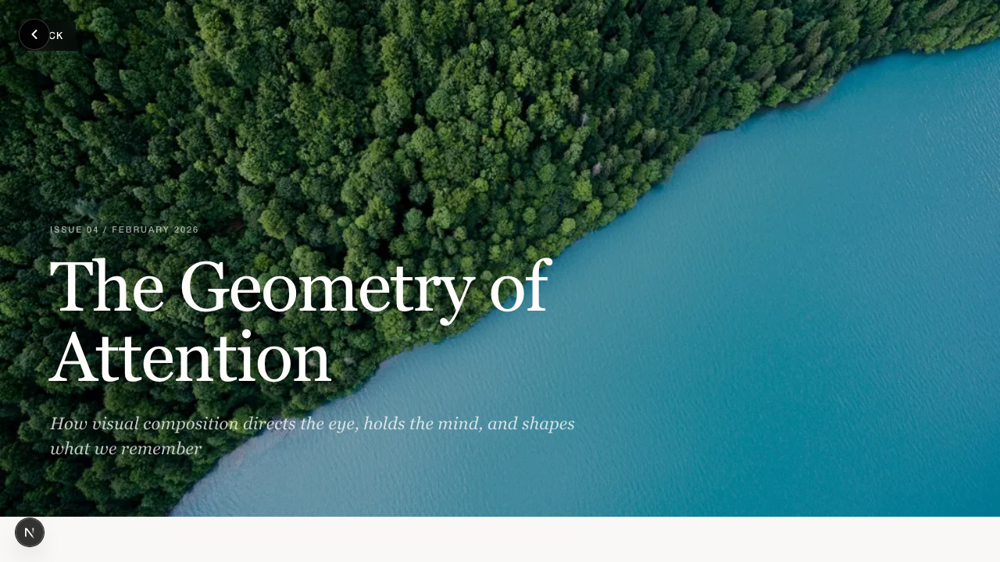
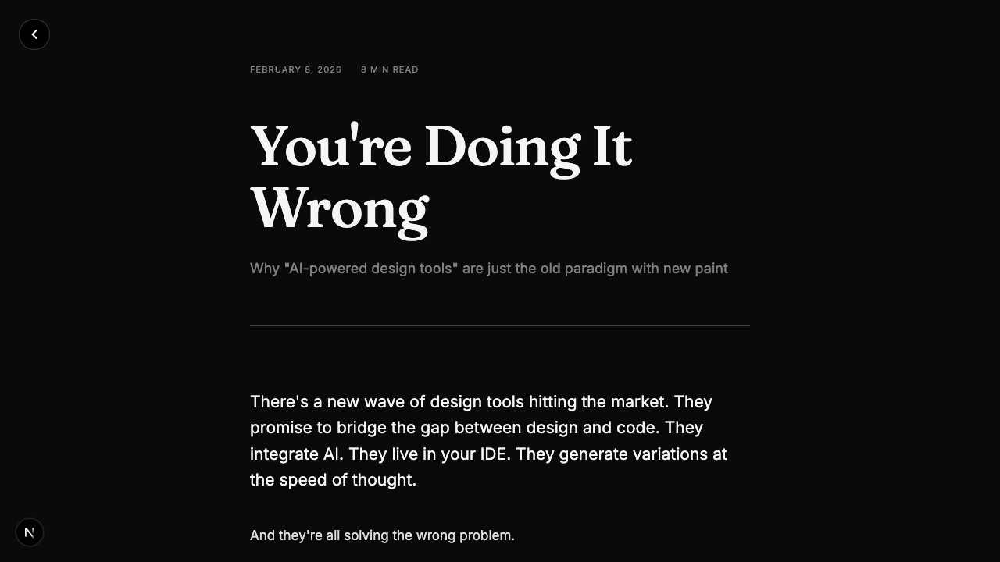
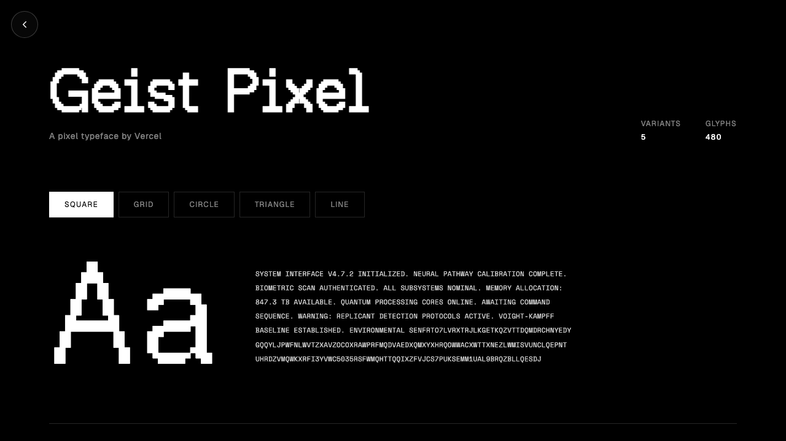
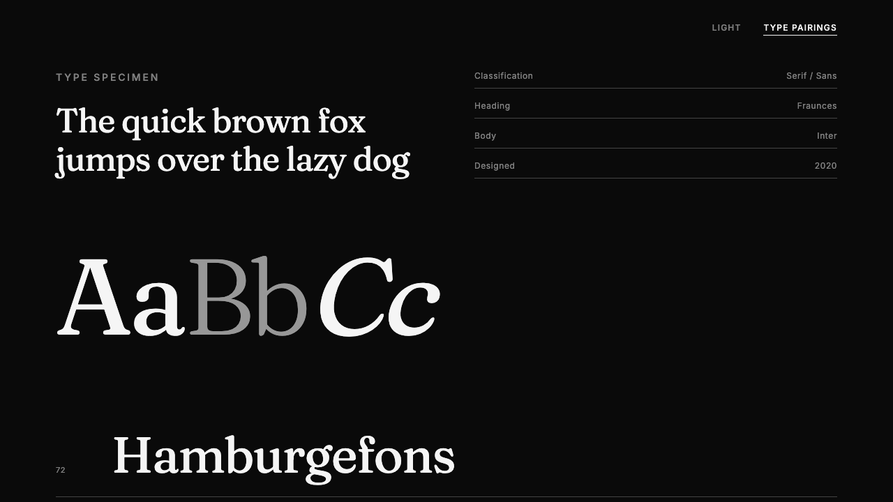

# Design Experiments

A Next.js-based sandbox for exploring visual design systems, widgets, and interactive patterns.

---

## Experiments

### CrossFit Bento

**February 20, 2026**

[](https://www.joshcoolman.com/design-experiments/crossfit-bento)

Dark bento grid dashboard for CrossFit training data. Nine widget cards covering goal progress, calorie tracking, weekly training load bar chart, GitHub-style activity heatmap with flame icons on peak days, WOD stats, macro donut chart, exercise log with PR badges, heart rate zones, and sleep stages. DM Sans body with Geist Pixel Square for technical labels. Matte finish palette -- orange, olive, brown accents on near-black.

**Tags:** Bento Grid - Dashboard - Geist Pixel - Dark Theme

**[View Live →](https://www.joshcoolman.com/design-experiments/crossfit-bento) | [View Code →](https://github.com/joshcoolman-smc/sandbox/tree/main/app/design-experiments/crossfit-bento)**

---

### Sticky Notes

**February 18, 2026**

[](https://www.joshcoolman.com/design-experiments/sticky-notes)

Interactive sticky note stack component. Post-it notes rendered from markdown files with swipe-to-cycle animation, color variants (warm, cool, neutral), and Permanent Marker handwriting font. Click to expand, click to cycle, Escape to close. Portable design -- consumer passes a notes directory path, so any page can use it with its own content. Currently used by the blog for "note to self" thoughts.

**Tags:** Component - CSS Animation - Markdown Content - Portable

**[View Live →](https://www.joshcoolman.com/design-experiments/sticky-notes) | [View Code →](https://github.com/joshcoolman-smc/sandbox/tree/main/app/design-experiments/sticky-notes)**

---

### Contact Sheet

**February 17, 2026**

[](https://www.joshcoolman.com/design-experiments/contact-sheet)

Image folder browser for building file lists to share with LLMs. Pick a folder, click images to select them, and a sidebar shows your selections with thumbnails. Copy the filename list to clipboard with one click. Designed for the workflow of visually identifying images then telling an LLM which ones to work with. Everything runs client-side -- nothing gets uploaded.

**Tags:** Utility - File API - Client-Side - Dark Theme

**[View Live →](https://www.joshcoolman.com/design-experiments/contact-sheet) | [View Code →](https://github.com/joshcoolman-smc/sandbox/tree/main/app/design-experiments/contact-sheet)**

---

### Font Pairings

**February 15, 2026**

[](https://www.joshcoolman.com/design-experiments/font-pairings)

A collection of 40 curated Google Font pairings, each displayed on its own color-palette card. Click any card to copy an LLM-ready specification prompt. Includes superfamily pairings, monospace+sans combos, and brand design system fonts. Avoids overused defaults -- no Montserrat, Roboto, Open Sans, Lato, Playfair Display, Raleway, Poppins, or Inter. Static HTML with inline CSS, no framework.

**Tags:** Typography - Font Pairings - Static HTML - Copy-to-Clipboard

**[View Live →](https://www.joshcoolman.com/design-experiments/font-pairings) | [View Code →](https://github.com/joshcoolman-smc/sandbox/tree/main/app/design-experiments/font-pairings)**

---

### Modular Grid

**February 14, 2026**

[](https://www.joshcoolman.com/design-experiments/modular-grid)

Swiss-inspired modular grid system for digital surfaces. 8px base unit, 4-column layout with proportional margins and gutters, strict vertical rhythm. Includes toggleable cyan grid overlay, type specimen, image treatment demos, and system spec table. Dark mode adaptation of a print-precision layout methodology originally built in Claude Desktop.

**Tags:** Grid System - Swiss Design - Dark Mode - Typography

**[View Live →](https://www.joshcoolman.com/design-experiments/modular-grid) | [View Code →](https://github.com/joshcoolman-smc/sandbox/tree/main/app/design-experiments/modular-grid)**

---

### Day at a Glance

**February 12, 2026**

[](https://www.joshcoolman.com/design-experiments/day-at-a-glance)

Time-aware workday timeline with a dynamic now-line that tracks real time. Features a 9am-5pm schedule with colored event bars that partially fill as the hour progresses -- gray above the now-line, color below. Past events auto-dim. Built with CSS grid, inline linear-gradient for the fill effect, and 60-second interval updates.

**Tags:** CSS Grid - Timeline - Dynamic State - Dark Theme

**[View Live →](https://www.joshcoolman.com/design-experiments/day-at-a-glance) | [View Code →](https://github.com/joshcoolman-smc/sandbox/tree/main/app/design-experiments/day-at-a-glance)**

---

### Sourcing Image

**February 11, 2026**

[](https://www.joshcoolman.com/design-experiments/sourcing-image)

A fully agentic editorial layout experiment. The only direction: source images from a personal library, pick a topic, and design an attractive page. Claude autonomously selected 10 photographs, invented an article about visual composition, wrote the editorial copy, and designed a high-end magazine layout with varied image treatments -- full-bleed hero, side-by-side pairs, sticky insets alongside body text, captioned feature images, an asymmetric photo grid, and a full-width closer. Set in Cormorant Garamond and DM Sans on warm off-white. Minimal human input beyond two layout refinements after the initial generation.

**Tags:** Agentic Design - Editorial Layout - Image Sourcing - Magazine

**[View Live →](https://www.joshcoolman.com/design-experiments/sourcing-image) | [View Code →](https://github.com/joshcoolman-smc/sandbox/tree/main/app/design-experiments/sourcing-image)**

---

### CrossFit Design Challenge: Day 2

**February 9, 2026**

[](https://www.joshcoolman.com/design-experiments/crossfit-challenge-2)

Day 2 leveled up the same four designer personas with new constraints: dark mode across all designs, meaningful animation (glitch effects, scroll reveals, chart animations), and data visualization (SVG charts, radial indicators, bar graphs). Same gym content, same personas, dramatically elevated execution. Pure CSS animations, no external libraries. Real CrossFit photography replaces gradient placeholders.

**Tags:** Dark Mode - CSS Animation - Data Viz - Agent Teams

**[View Live →](https://www.joshcoolman.com/design-experiments/crossfit-challenge-2) | [View Code →](https://github.com/joshcoolman-smc/sandbox/tree/main/app/design-experiments/crossfit-challenge-2)**

---

### CrossFit Design Challenge

**February 8, 2026**

[](https://www.joshcoolman.com/design-experiments/crossfit-challenge)

Four autonomous AI agents each designed a CrossFit homepage for IRON REPUBLIC gym, working in parallel with distinct aesthetic personas. Brutal/industrial, minimal/refined, editorial/magazine, and tech/data-forward approaches -- all built agenically with Claude Code agent teams, then refined with human-in-the-loop collaboration adding real photography and typography tweaks. Includes editorial writeup on the process.

**Tags:** Agent Teams • Design Challenge • CSS Modules • Multi-Layout

**[View Live →](https://www.joshcoolman.com/design-experiments/crossfit-challenge) | [View Code →](https://github.com/joshcoolman-smc/sandbox/tree/main/app/design-experiments/crossfit-challenge)**

---

### You're Doing It Wrong

**February 8, 2026**

[](https://www.joshcoolman.com/design-experiments/youre-doing-it-wrong)

Long-form blog post exploring why "AI-powered design tools" miss the point. Argues that agentic apps apply old paradigms to new technology, while the real shift is learning to work directly with agents through code. Features typography from Spec Sheet with editorial layout and accent highlights.

**Tags:** Blog Post • Typography • Editorial • Long-Form Content

**[View Live →](https://www.joshcoolman.com/design-experiments/youre-doing-it-wrong) | [View Code →](https://github.com/joshcoolman-smc/sandbox/tree/main/app/design-experiments/youre-doing-it-wrong)**

---

### Terminator - Text Scramble

**February 6, 2026**

[](https://www.joshcoolman.com/design-experiments/terminator)

Interactive terminal-style text scramble effect with two-phase animation. Enter custom text to see it scramble chaotically for 1 second, then resolve sequentially line-by-line. Features balanced line breaking and automatic uppercase conversion. Default text: Ghost in the Shell quote on identity and consciousness.

**Tags:** Text Animation • Terminal UI • Interactive • Split-Flap Effect

**[View Live →](https://www.joshcoolman.com/design-experiments/terminator) | [View Code →](https://github.com/joshcoolman-smc/sandbox/tree/main/app/design-experiments/terminator)**

---

### Geist Pixel

**February 6, 2026**

[](https://www.joshcoolman.com/design-experiments/geist-pixel)

Typographic specimen featuring Vercel's Geist Pixel display font with 5 bitmap-inspired variants. Includes a split-flap text scramble effect using Space Mono - solid wall of characters that resolves line-by-line into readable text. Click to replay the animation.

**Tags:** Typography • Split-Flap Effect • Text Animation • Monospace

**[View Live →](https://www.joshcoolman.com/design-experiments/geist-pixel) | [View Code →](https://github.com/joshcoolman-smc/sandbox/tree/main/app/design-experiments/geist-pixel)**

---

### Color Spec

**February 6, 2026**

[](https://www.joshcoolman.com/design-experiments/color-spec)

Interactive brand guidelines with live color and typography customization. Features animated Activity line chart and Analytics bar chart widgets with CSS-only animations. Click the gear icon for a push-in sidebar with color pickers using Chroma.js scale generation and 9 curated font pairings. All changes persist via localStorage.

**Tags:** React Components • Animated Charts • Color Systems • Typography

**[View Live →](https://www.joshcoolman.com/design-experiments/color-spec) | [View Code →](https://github.com/joshcoolman-smc/sandbox/tree/main/app/design-experiments/color-spec)**

---

### Blend

**February 2, 2026**

[](https://www.joshcoolman.com/design-experiments/blend)

Swiss modernist gradient specimen system featuring organic mesh gradients via SVG blur technique. Includes 27 gradient cards across linear and mesh styles, systematic labeling (G-01 through G-09, M-01 through M-18), scroll-triggered animations, and an analytics dashboard mockup.

**Tags:** Gradients • SVG Mesh • Swiss Design • Scroll Animation

**[View Live →](https://www.joshcoolman.com/design-experiments/blend) | [View Code →](https://github.com/joshcoolman-smc/sandbox/tree/main/app/design-experiments/blend)**

---

### Spec Sheet

**January 28, 2026**

[](https://www.joshcoolman.com/design-experiments/spec-sheet)

Bold typographic layout with dark/light mode toggle. Features strong hierarchy through scale contrast, clean sectioning, and a professional two-color aesthetic.

**Tags:** Typography • Dark Mode • Minimal • Two Column

**[View Live →](https://www.joshcoolman.com/design-experiments/spec-sheet) | [View Code →](https://github.com/joshcoolman-smc/sandbox/tree/main/app/design-experiments/spec-sheet)**

---

## Development

```bash
npm run dev    # Start Next.js dev server on port 3000
npm run build  # Build for production
npm start      # Run production build
```

## Structure

```
/
├── app/                          # Next.js App Router
│   ├── page.tsx                  # Homepage
│   ├── layout.tsx                # Root layout
│   ├── globals.css               # Global styles
│   ├── design-experiments/
│   │   ├── page.tsx              # Experiments gallery
│   │   ├── blend/
│   │   ├── color-spec/
│   │   ├── day-at-a-glance/
│   │   └── [other experiments]/
│   └── blog/
├── public/
│   └── screenshots/              # Preview images for README
├── next.config.js                # Next.js configuration
└── CLAUDE.md                     # Development workflow
```

## Purpose

This sandbox is for rapid design exploration—building visual systems, testing layouts, and creating reusable design patterns. Built with Next.js for unlimited interactivity while maintaining clean organization.

### Adding New Experiments

To add a new experiment:

1. Create `/app/design-experiments/[experiment-name]/page.tsx` with your React component
2. Add screenshot to `/public/screenshots/experiment-name.png`
3. Update experiments gallery in `/app/design-experiments/page.tsx`
4. Update this README with experiment details

---

## Claude Code Skills

This repo includes custom skills for [Claude Code](https://claude.ai/code) that streamline common development workflows. While not all skills are specific to this sandbox project, they're general-purpose utilities I use across different projects.

### Available Skills

**`/sanity-check`**
Quick React/TypeScript/Next.js code review from a senior engineer perspective. Catches common issues and suggests practical improvements without being pedantic.

**`/ship-experiment`**
Automated workflow for shipping design experiments: screenshots with agent-browser, updates gallery and README, commits changes, and pushes to GitHub (triggers Vercel deploy).

**`/supabase`**
Comprehensive Supabase CLI wrapper for database operations: schema migrations with validation, TypeScript type generation, edge function deployment, and postgres best practices integration.

**`/palette`**
Generate a complete color system from a single starting color. Uses chroma-js with OKLCH interpolation to build 50-950 scales, accessible pairings, dark mode variants, and complementary accent/neutral palettes. Outputs ready-to-use CSS custom properties.

**`/image-prep`**
Prepare images for experiments -- resize, crop to standard presets (hero, card, thumbnail, OG), optimize with sharp, convert to WebP, and generate Next.js `<Image>` markup with correct dimensions.

**`/promote`**
Graduate a design experiment into a reusable component. Analyzes an experiment, identifies the reusable core, designs a typed props API, extracts it into a portable component with CSS Modules, and refactors the original experiment to use the new component.

**`/type-spec`**
Generate a typographic system from a font pairing. Builds a modular type scale with fluid clamp() sizing, vertical rhythm, CSS custom properties, and an optional specimen preview. Supports the 40 curated pairings from the font-pairings experiment.

**`/design-audit`**
Audit a design experiment's CSS for color and type consistency. Extracts every color and font-size, groups by context (light bg vs dark bg), flags near-duplicates and inconsistent roles, then suggests unifications. Interactive -- select which fixes to apply, get a before/after summary table of the cleaned system.

**`/sketch`**
Rapid visual prototyping -- paint with code. Single-file, Tailwind-only, no component libraries, no data layer. Get a visual idea on screen fast and iterate until it feels right. Hardcoded content, fake interactions, inline animations. The napkin drawing before the architecture. Feeds naturally into `/promote` when the design is locked.

### Using Skills

Skills are invoked with a slash command in Claude Code:

```bash
/sanity-check              # Review current code
/ship-experiment           # Ship the current experiment
/supabase migrate "..."    # Create database migration
/palette #2563EB           # Generate color system from hex
/image-prep public/img/    # Resize and optimize images
/promote sticky-notes      # Extract reusable component
/type-spec "Space Grotesk" "IBM Plex Mono"  # Generate type system
/design-audit crossfit-bento  # Audit colors and type for consistency
/sketch A breathing app with animated circles  # Rapid visual prototype
```

### Skill Location

Skills are stored in `.claude/skills/` and are committed to this repo. They work in any project when this directory structure is present, or can be copied to other repos individually.
